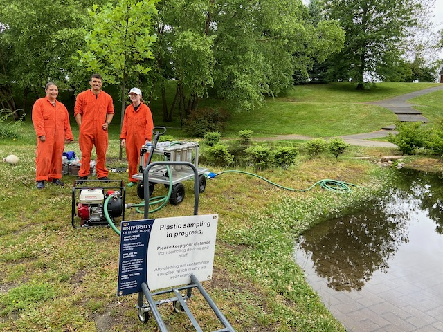

# URI Microplastic Pump-Filter System

The URI pump-filter system has been developed to improve our sampling volume for small plastic particles (down to 10 μm in size) whilst reducing contamination risk both before, during and after sampling. Field sampling methodologies for microplastics have been rapidly developing over recent years, however, many studies still rely solely on trawling surface waters using Manta Trawl systems, or sample only small volumes. This has led to limitations in the number of studies that sample microplastics at lower size fractions and the detectability of such particles. Our system is a modification of the design proposed by [Lenz and Labrenz (2018)](https://www.mdpi.com/2073-4441/10/8/1055), but includes an alternative gradient filtration approach that allows for size fractionation of our samples at the point of collection. This also serves to increase sample volume throughout the sampled size range, and eases analyses in the laboratory.

*General overview of our team sampling with the pump-filter in Roger Williams Park, RI in 2022*

##### Table of Contents
[Technical Description](TECHNICALDESCRIPTION.md)
[Technical Verification](TECHNICALVERIFICATION.md)
[Field Methods](FIELDMETHODS.md)
