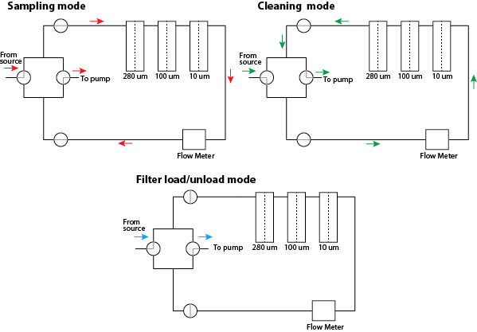

# Technical Description

The system is constructed from fully stainless steel (SS 316) 0.75 inch pipe and fittings mounted on an aluminum frame with 3D printed mounting parts constructed from PETG plastic. Pumping power is provided by a Honda WXT15 or a GX160 gas pump for remote field operations. The basic system consists of two L-valves that allow us to change the directionality of water flow to allow for three functions, “sampling”, “cleaning” and “filter load/unload”. These functions are critical for effective sampling that limits potential contamination of our samples from our clothing and other airborne contaminants. No plastic parts are in contact with our sampled water (with the exception of the intake sampling hose; green PVC). The pump and flow meter are both situated behind the filter line, with the pump in a suction mode. Whilst suction is a less efficient pumping approach, it removes any potential sources of contamination from mechanically abraded parts, such as the pump impeller. Additionally, the seals on valves and cartridge filters are a rubber form. We can change or select filter sizes for specific situations but have established a size fractionation range of 280μm, 100μm and 10μm in series. Flow rate and volume are monitored using a domestic water flow meter commonly used to record freshwater flow, it provides accurate readings to +/- 1% of total volumetric flow.

*Schematic of the pump-filter system under different functional modes, including sampling, cleaning and filter load/unload. Valves are illustrated with the grey line(s) in a circle, and includes two valve types, straight and L.*
