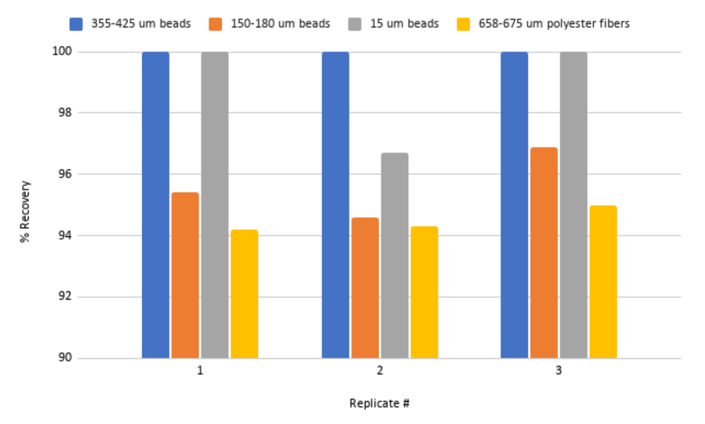

# Technical verification

We have undertaken a series of plastic and fiber recovery trials to test the pump-filter system and the methodology described above. In Lenz and Labrenz (2018), cylindrical plastic particles (polyamide) with a length of 450 μm and a diameter of 480 μm were seeded within their system, with a recovery rate of 98.9%. We conducted similar methodological trials, however, we used a range of particle sizes and types in an attempt to stress test the system. This exhaustive testing allowed us to develop a standard operating procedure for operating the pump-filter system as well as extracting samples from the filters once they are taken out of the pump-filter system. Our basic seeding protocol utilized 3 different sizes of polyethylene fluorescent beads with sizes of 355-425 μm, 150-180 μm, and 15 μm, as well as polyester fibers (width of 17-20 μm, length of 658-675 μm). To conduct each trial we counted about 100 of each size and type and seeded these into the intake of the pump-filter system.

During conducting numerous trials (approximately 30 in total), many improvements were made to the extraction procedure to bolster fiber and bead recovery rates. We found that sonication of the filter cartridges is necessary to obtain recovery rates of 94% or better since washes with squeeze bottles alone do not remove all particles and fibers entrained on the filter mesh. Standardized methodologies and high levels of training and practice are also needed to ensure repeatable extraction protocols that were consistent between trials and users.

Below are a series of results from one of our later trials that ultimately drove the adoption of our field methodologies. This included an additional step was the washing of the bottom of the canisters used to house the filter cartridges within the pump-filter system a total of 5 times to dislodge any portion of the sample stuck under the spring located at the bottom of the canister. The use of a flathead screwdriver to gently break the suction seal between the canister holding the filter cartridge and the system frame was also found to help reduce splashing of the water in the canister out of the sample. Any water that does splash out is caught in a metal bucket placed just below the canister. Tracking down missing beads after each of the pilot recovery trials helped determine these improvements were needed and allowed for refinement of the method. We achieved between 94.2% and 100% recovery rate for our different particle sizes and types and obtained 100% average recovery of our 355-425 µm beads, exceeding the results Lenz and Labrenz (2018) obtained with their 480 μm diameter polyamide particles.

|           | Beads      | Beads      | Beads     | Fibers    |
| --------- | ---------- | ---------- |---------- |---------- |
| Replicate | 355-425 μm | 150-180 μm | 15 μm | 658-675 μm |
| 1         | 100        | 95.4       | 100 | 94.2 |
| 2         | 100        | 94.6       | 96.7 | 94.3 |
| 3         | 100        | 96.9       | 100 | 95 |
| Mean      | 100        | 95.6       | 98.9 | 94.5 |

*Validation trials of pump-filter seawater collection system using 3 sizes of fluorescent, polyethylene bead sizes in addition to polyester fibers. The number of fibers and beads used to seed the system ranged between 73 and 108 per particle type per replicate.*

**The full operating procedure for the verification of the system can be found [here](Protocols/SOP_Pump-filter_spike_test.pdf)**
